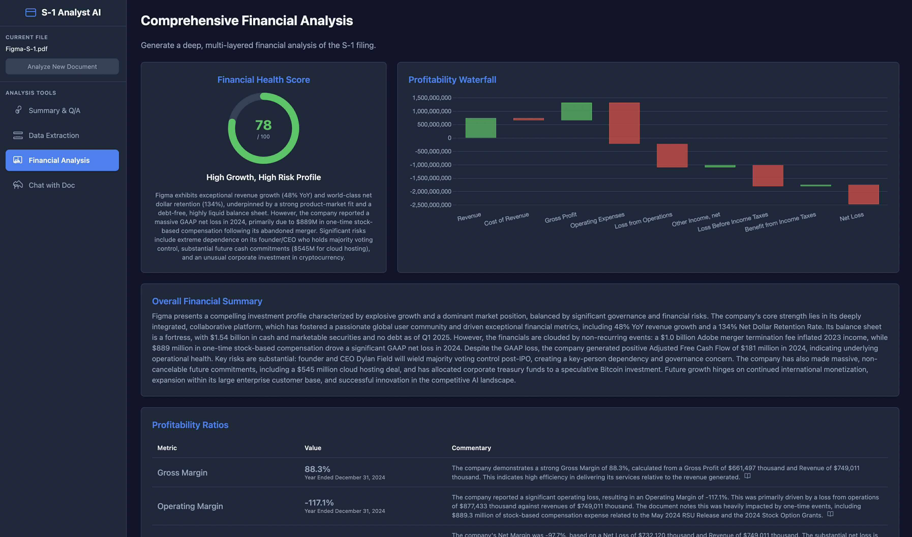
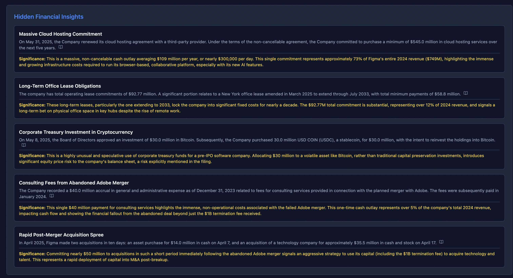

# S-1 Analysis AI

A sophisticated AI-powered tool for analyzing S-1 IPO filings using Google's Gemini AI. This application provides comprehensive financial analysis, data extraction, and interactive Q&A capabilities for SEC S-1 documents.

## 📸 Screenshots

### Financial Analysis Dashboard

*Comprehensive financial health scoring, waterfall charts, and detailed ratio analysis*

### Application Interface

*Clean, modern interface with sidebar navigation and multiple analysis tools*

## 🚀 Features

### 📊 Summary & Q/A
- **Interactive Analysis**: Ask specific questions about the S-1 filing
- **Predefined Questions**: Quick access to common queries like risk factors, business model, and key executives
- **Confidence Scoring**: AI-generated confidence scores for each analysis
- **Citation Support**: Direct quotes from the document to support answers

### 📈 Data Extraction
- **Financial Metrics Extraction**: Extract key financial data points with automatic parsing
- **Visual Charts**: Automatic chart generation for numeric data with 2+ data points
- **Predefined Extractions**: One-click extraction for common metrics like revenue, net income, and operating expenses
- **Period-based Analysis**: Track financial metrics across different time periods

### 💰 Financial Analysis
- **Comprehensive Financial Health Score**: 0-100 scoring system with detailed ratings
- **Waterfall Charts**: Visual representation of financial flows and changes
- **Financial Ratios**: Automated calculation and analysis of:
  - Profitability ratios
  - Growth and efficiency metrics
  - Liquidity and leverage ratios
- **Trend Analysis**: Year-over-year change analysis with AI commentary
- **Hidden Insights**: AI-powered discovery of significant but buried financial information
- **IPO-Specific Analysis**: Specialized insights on use of proceeds, customer concentration, and share structure

### 💬 Interactive Chat
- **Document-aware conversations**: Chat with the AI about the specific S-1 filing
- **Contextual responses**: AI maintains context throughout the conversation
- **Streaming responses**: Real-time response generation for better user experience

## 🛠 Technical Stack

- **Frontend**: React 19 with TypeScript
- **AI Integration**: Google Gemini AI (@google/genai)
- **Visualization**: Chart.js for interactive charts and graphs
- **Styling**: Tailwind CSS with custom dark theme
- **Markdown Support**: Enhanced markdown rendering with math support (KaTeX)
- **Build Tool**: Vite for fast development and optimized builds

## 📋 Prerequisites

- **Node.js** (version 16 or higher)
- **Google Gemini API Key** - Get one from [Google AI Studio](https://aistudio.google.com/)

## 🚀 Getting Started

### 1. Clone the Repository
```bash
git clone https://github.com/raztronaut/S-1-Analysis-AI.git
cd S-1-Analysis-AI
```

### 2. Install Dependencies
```bash
npm install
```

### 3. Configure Environment Variables
Create a `.env.local` file in the root directory:
```env
GEMINI_API_KEY=your_gemini_api_key_here
```

### 4. Run the Application
```bash
npm run dev
```

The application will be available at `http://localhost:5173`

## 📖 How to Use

### 1. Upload Document
- Start by uploading an S-1 filing document
- Supported formats: PDF, TXT, and other text-based documents
- The app will process and prepare the document for analysis

### 2. Navigate Between Features
Use the sidebar to switch between different analysis modes:

- **Summary & Q/A**: Ask questions or use predefined queries
- **Data Extraction**: Extract specific financial metrics and visualize trends
- **Financial Analysis**: Get comprehensive financial health assessment
- **Chat**: Have a conversation about the document

### 3. Analyze Results
- Review AI-generated insights with confidence scores
- Click on citations to see exact quotes from the document
- Download or export analysis results for further use

## 🎯 Use Cases

- **Investment Analysis**: Evaluate IPO opportunities with AI-powered insights
- **Due Diligence**: Quickly extract and analyze key financial metrics
- **Research**: Academic or professional research on public company filings
- **Educational**: Learn about financial analysis and S-1 document structure

## 🏗 Project Structure

```
src/
├── components/           # React components
│   ├── common/          # Reusable UI components
│   ├── Chat.tsx         # Interactive chat interface
│   ├── DataExtraction.tsx # Financial data extraction
│   ├── FinancialAnalysis.tsx # Comprehensive financial analysis
│   ├── FileUpload.tsx   # Document upload handling
│   ├── Sidebar.tsx      # Navigation sidebar
│   └── SummaryQA.tsx    # Q&A interface
├── services/            # External service integrations
│   └── geminiService.ts # Google Gemini AI integration
├── data/               # Sample data and constants
├── types.ts            # TypeScript type definitions
├── constants.ts        # Application constants
└── App.tsx             # Main application component
```

## 🔧 Configuration

### Environment Variables
- `GEMINI_API_KEY`: Your Google Gemini API key (required)

### Customization
- Modify `constants.ts` to add custom predefined questions and extractions
- Update the theme in the CSS for custom styling
- Add new analysis features by extending the component structure

## 🚀 Building for Production

```bash
npm run build
```

The built application will be in the `dist/` directory, ready for deployment to any static hosting service.

## 📝 API Integration

The application uses Google's Gemini AI for:
- **Text Analysis**: Natural language processing of S-1 documents
- **Data Extraction**: Structured extraction of financial metrics
- **Financial Analysis**: Complex financial ratio calculations and insights
- **Conversational AI**: Interactive chat capabilities

## 🤝 Contributing

1. Fork the repository
2. Create a feature branch (`git checkout -b feature/amazing-feature`)
3. Commit your changes (`git commit -m 'Add amazing feature'`)
4. Push to the branch (`git push origin feature/amazing-feature`)
5. Open a Pull Request

## 📄 License

This project is licensed under the MIT License - see the [LICENSE](LICENSE) file for details.

## 🙏 Acknowledgments

- **Google Gemini AI** for powerful language model capabilities
- **Chart.js** for beautiful data visualizations
- **React Team** for the excellent framework
- **Vite** for lightning-fast development experience

## 📞 Support

For questions, issues, or feature requests, please open an issue on GitHub or contact the maintainer.

---

**Built with ❤️ for better financial analysis and AI-powered insights**
